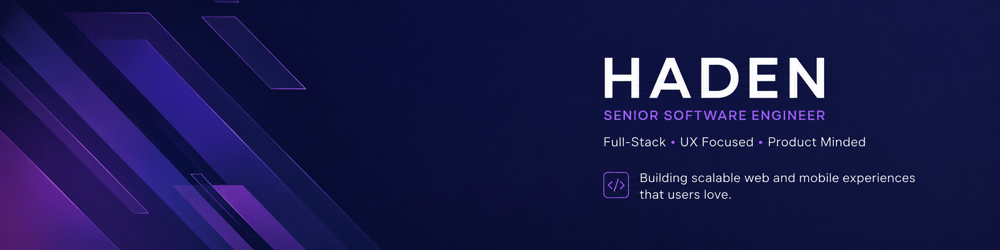

[](https://portfolio.hadenhiles.com)

# Senior Software Engineer | Product, Mobile & Full-Stack

I’m a senior software engineer with 10+ years of experience turning loosely defined product and business needs into production mobile applications, web platforms, and integrations.

I own delivery from discovery and architecture through implementation, deployment, measurement, and long-term operation. My work combines hands-on engineering with product judgement and UX expertise: define the right problem, make the complex feel simple, ship reliably, and improve based on real-world results.

[Portfolio](https://portfolio.hadenhiles.com) · [Resume](./public/resume.pdf) · [LinkedIn](https://linkedin.com/in/hadenhiles) · [Email](mailto:hi@hadenhiles.com)

## Impact

- Own the architecture, development, release management, and technical direction of **10,000 Shots**, a Flutter and Firebase application with **80,000+ registered accounts** and approximately **2,500 daily active users**
- Designed team-based competition features that helped **double daily active users**
- Launched a guided training experience and freemium model that **tripled subscription conversion**, contributing to roughly **250 daily downloads** and **25 new Pro subscriptions per day**
- Built and operate **The Pond**, a membership and learning platform generating an estimated **$30,000 in annual revenue**
- Delivered mobile, web, e-commerce, and integration projects from requirements analysis through deployment, training, and support
- Designed and developed **50+ bespoke client websites** and custom transactional systems

## Technical Expertise

| Area | Technologies and capabilities |
| --- | --- |
| Languages & frameworks | Dart, TypeScript, JavaScript, SQL, Python, PHP, Flutter, React, Next.js, Node.js, Express, WordPress |
| Data & integrations | Firebase, Cloud Firestore, PostgreSQL, MySQL, REST APIs, GraphQL, payment systems, POS integrations |
| Cloud & delivery | Docker, Linux, Git, GitHub Actions, CI/CD, AWS, DigitalOcean, DNS, reverse proxies, networking |
| Engineering & product | Software architecture, system design, product discovery, requirements analysis, UX/UI design, accessibility, testing, technical documentation, stakeholder communication |

## Selected Work

### [10,000 Shots](https://github.com/HadenHiles/TenThousandShotChallenge)

A production Flutter and Firebase training platform for hockey players. I lead its architecture and delivery across mobile development, real-time data, subscriptions, product discovery, release management, and long-term operation.

The product is designed around a simple goal: let players log training quickly, understand their progress, and stay motivated. Behind that experience are real-time Firestore streams, team competition, guided training, in-app purchases, analytics, and automated delivery workflows.

### [The Pond](https://github.com/HadenHiles/ThePond)

A WordPress, LearnDash, and MemberPress membership platform for structured hockey training. I built the learning experience, subscription flows, gated content, member dashboards, and supporting operational systems.

The platform balances a clear progression for players with maintainable workflows for non-technical administrators.

### [Group of Seven Trail App](https://github.com/HadenHiles/G7TrailApp)

A Flutter application combining interactive mapping, Bluetooth beacons, and contextual content into a location-aware visitor experience.

I resolved cross-platform Bluetooth failures in an unsupported dependency, migrated the application to a sustainable replacement, and restructured it ahead of beta launch. I also redesigned the organization’s [public website](https://groupofseventrail.com).

### [Skill Drills](https://github.com/HadenHiles/skill-drills)

A customizable training product that lets users create reusable routines, define flexible performance metrics, complete structured sessions, and track improvement across different training styles.

### [WatchBracket](https://bracket.famflix.live)

A self-hosted, open-source real-time bracket voting app that turns movie night decision paralysis into a quick, fair group decision. The host creates a room, everyone joins by code, each person nominates their top two picks, and titles go head-to-head until one survives as tonight's feature presentation. A shared display mode puts the live bracket on the TV while everyone votes from their phone.

Built with Django, Python, WebSockets, and an optional Plex integration that surfaces watchlist and taste-based suggestions without requiring an account.

### [FamFlix](https://github.com/HadenHiles/famflix-stack)

A self-hosted family media platform spanning containerized services, reverse proxies, secure remote access, monitoring, and automated workflows across NAS and Windows systems.

### [Lyric Pilot](https://github.com/HadenHiles/LyricPilot)

A Flutter-based lyric and chord practice app built around tempo control, section looping, and progressive independence. Its dedicated scroll engine and playback state machine keep practice logic separate from the interface.

[Download Lyric Pilot on itch.io](https://hadenhiles.itch.io/lyric-pilot).

## Experience

- **Lead Software Engineer, How To Hockey** — October 2019–Present
- **Independent Software Consultant, BugsLife Solutions** — September 2015–July 2025
- **Web Specialist, Marketing, Georgian College** — September 2018–September 2019
- **Programmer & Integration Development Manager, LinkGreen** — August 2017–December 2017
- **Senior Web Developer, Geek Power Web Design** — January 2017–August 2017
- **Web Designer & Developer, Media Suite Inc.** — June 2014–September 2015

## How I Work

- Start with the user and the business outcome
- Turn ambiguity into requirements, architecture, and an achievable delivery plan
- Prototype early when it reduces product or technical risk
- Prefer simple, maintainable systems over unnecessary cleverness
- Treat reliability, accessibility, and operational clarity as product features
- Measure what ships and use the evidence to guide what comes next

## About This Repository

This repository contains the source for [portfolio.hadenhiles.com](https://portfolio.hadenhiles.com), my interactive portfolio built with Next.js, TypeScript, Tailwind CSS, Framer Motion, and Zustand.

Run it locally:

```bash
npm install
npm run dev
```

Then open [http://localhost:3000](http://localhost:3000).

---

I’m based in Ontario, Canada. If you’re building a product that needs strong engineering, practical product thinking, and end-to-end ownership, email me at [hi@hadenhiles.com](mailto:hi@hadenhiles.com).
